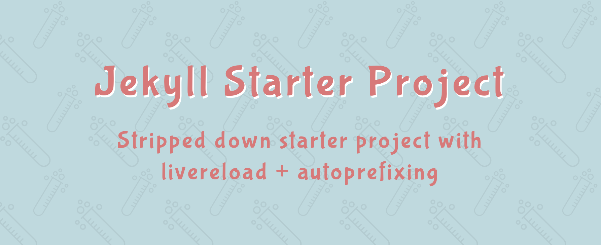

# Stripped Down Jekyll Starter Project



## Oh no, not another theme… 🙄

Nope this isn't a theme! I've been exploring jekyll lately and a few things annoy me:

1. Starting a new project via `jekyll new [my-project-name]` gives me a starter theme that's way too bloated.
2. On the flip side, using `jekyll new [my-project-name] --blank` doesn't even give me a `config.yml` file.
3. In both cases, no livereload or autoprefixing out of the box.

You can think of this as the Goldilocks of starter projects and you can check it out here: [https://luclemo.github.io/jekyll-starter/](https://luclemo.github.io/jekyll-starter/)

You can also [read more about why I made this](https://medium.com/@luclemo/using-jekyll-for-rapid-prototyping-31d5419b8d94).

**OMG it's so ugly!** 😱

Yup. that's the point. Now go make it gorgeous.

---

## Features 🍬

This is _not_ a theme. It's just a directory with some good starter bits:

### Super basic file structure 📂

I've included a few things common to many projects:

- `404` and `about` page
- Navigation logic
- Heavily commented config file and useful site data
- Blog structure and permalinks. Don't want/need a blog it? Just delete the `_posts` directory and `blog.html` file. Done. 

### Minimal styling 🎨

- A few SCSS variables (colors & fonts)
- A few handy mixins (like really, there are 3)
- A bunch of empty sass partials for organization. Use 'em or don't.

### Do I need Gulp … Grunt … PostCSS … la-la-la ? 👯

Nope. If all you're after is livereload and autoprefixing, it just works out of the box. However, you can definitely add/replace with your tooling of choice.  
This is just a starting point; go wild.

---

## Getting started 🚦

**Assumptions before we get going:**

You will need some _very_ minimal command line abilities. You will also need to know what jekyll is and have it installed on your machine. A few good resources for each: [Command Line Power User](https://commandlinepoweruser.com/) and [Jekyll docs](https://jekyllrb.com/docs/home/).

### 1. Let's get this project to your machine ⬇️

Move into directory of your choice:

```text
cd path/to/directory-of-your-choice
```

Create the project inside that directory:

```text
git clone https://github.com/luclemo/jekyll-starter.git
```

### 2. Working locally 👩‍💻

Fire up your project:

```text
jekyll serve --config _config.yml,_config_dev.yml
```

Files are served at `localhost:4000` from the `_site` directory.

Your browser will automatically reload to show you your changes on save.

#### Development environment

Add development-specific settings to `_config_dev.yml` (these override `_config.yml`)

I have included a handy development variable to use anywhere in your logic:

```text

   
    Do things only locally!


```

**Note about autoreload:**  
All changes are compiled and auto-reloaded on save except edits to `_config.yml` and `_config_dev.yml`.  
Restart the server when you change these files.

---

## Basic Hosting (FTP) 🚀

### 1. Configuration

_You should only have to do this once..._

Open `_config.yml` file and edit the url and baseurl values for your host:

The hostname & protocol for your site:

```text
url: "https://yourdomain.com"
```

If your site will be served from a subdirectory, add it here:

```text
baseurl: "/sub-directory"
```  

Otherwise leave a set of empty quotes:

```text
baseurl: ""
```

### 2. Build step for production

Rebuild your files with your new productions details:

```text
jekyll build
```

### 3. Getting it on your server

Just upload the content of `_site` directory via FTP.

Visit your site at `yourdomain.com` 👏

---

## Hosting on Github 😺

### 1. Configuration

_You should only have to do this once..._

Open `_config.yml` file and edit the `url` and `baseurl` values for Github:

```text
url: "http://username.github.io"

baseurl: "/repository-name"
```

### 2. Edit repo settings

In the `settings` tab for your repo, point Github pages `source` to your `master branch`.

_Alternatively create/use another branch._

### 3. Push your changes

Commit and push recent changes.

### 4. See your site live

Give it a few minutes and your site should be live at

`http://username.github.io/repository`

### 5. Making Updates

- Fire up your [local server](#working-locally------------)
- Make your changes
- Push your changes

Github pages automatically runs the build process for you when you commit.

## I have questions, complaints, high-fives…!

Ok. Shoot. Do it with an issue or a [tweet](https://twitter.com/luclemo) ✌️